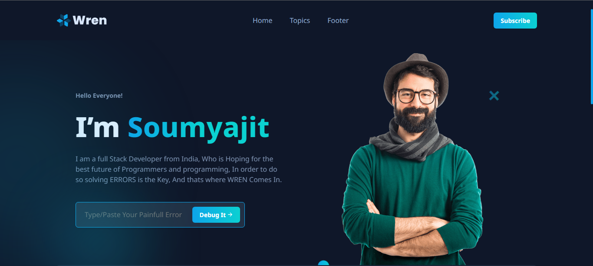

# Wren-Git-Init-2023

This is the submission project of Git Init 2023 Hackathon, It uses AI to solve programming errors to provide mental peace to programmers
## Clone it

To run this on your local computer just use this 

For Windows

```bash
  git clone git@github.com:cleverhare/Wren-Git-Init-2023.git
```
For MacOS and Linux based distributions
```bash
 sudo git clone git@github.com:cleverhare/Wren-Git-Init-2023.git
```
After that Just run the following
```bash
 npm install
```
Then run the following command in your favortite terminal
```bash
node server.js 
```
or alternatively 
```bash
npm run dev
```
which is intended to use for development purpose, and this command in the backend use nodemon as a package
## Features

- You can Solve any Error of Any Programming Langauge (90% Success Rate)


## Tech Stack

**Client:** HTML, CSS, JavaScript

**Server:** NodeJS, ExpressJS, Other modules 


## Screenshots




## Contributing

Contributions are always welcome!

You have to raise an issue for everychange that you want in the application.

You will be assigned if the issue or recomendation found legit and worth adding. 


## Thank You

Thank You very much for reading this till the end..

## Make sure you add your own api key of open ai to get everything working 
